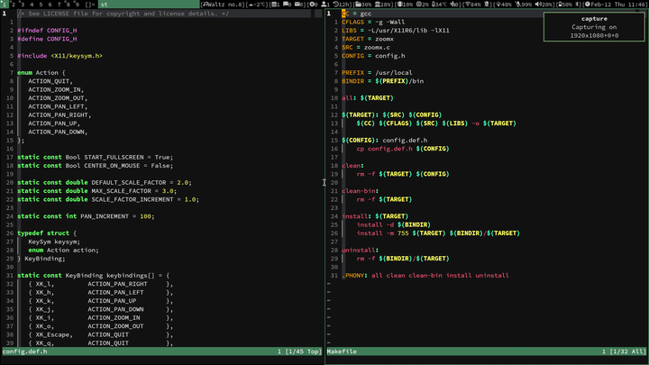

#  My fork of [ZoomX](https://github.com/nprezant/zoomx) - simple zooming tool for X


## What's the difference?
- Add `Makefile`
- Add `config.h`
- Change default keybindings to vi binidngs

## Usage
Create keybindings for zoomx in your window managers.

## default bindings
| | |
|:---|:---|
| movement | <kbd>h</kbd> <kbd>j</kbd> <kbd>k</kbd> <kbd>l</kbd> |
| zoom in | <kbd>i</kbd> |
| zoom out  | <kbd>o</kbd> |
| quit | <kbd>Esc</kbd> <kbd>q</kbd> |

## Configuration
All configuration is done by editing `config.h` and recompiling, in the same
manner as any [suckless](https://suckless.org) software.

## Build
```sh
# install
make install
# uninstall
make uninstall
```
